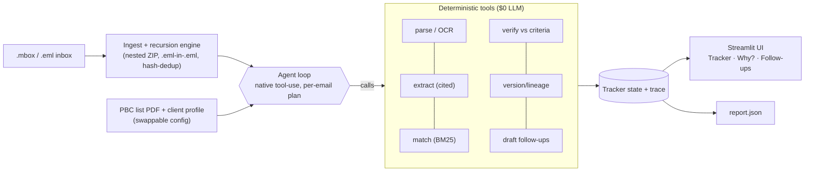

# PBC Email Agent — 1-Page Design

**What it is.** An agent that lives on an audit inbox and keeps a live, structured PBC
(prepared-by-client) tracker current — deciding, per document, whether the client delivered
what was asked (from **contents, never filenames**) with a reasoning trace a partner could
defend to a PCAOB inspector, and drafting grouped follow-ups for what's open.

## Architecture

Control flow is **agent-driven** (Claude decides per email what to do); the heavy lifting is in
**deterministic, unit-tested tools**. The loop is one file (`agent/loop.py`, ~180 lines).

## Model choice per step (route by cost)

| Step | Engine | Why |
|---|---|---|
| Per-email planning | **Claude Haiku 4.5** (default) | cheap dynamic control flow |
| ↳ escalation (≥4 attachments / ambiguous) | **Claude Sonnet 5** | harder reasoning, rare |
| Candidate matching | **BM25** (no LLM) | embeddings-class recall at $0 |
| Parse · OCR · extract · verify · version · draft | **Deterministic code** | reproducible, testable, $0 |

## Tools (native tool-use schemas)

`parse_attachment(doc_id)` · `extract_fields(doc_id)` · `match_item(doc_id)` ·
`verify_item(item_id, doc_ids[])` · `note_schedule(item_id, new_date)` · `draft_followups()` ·
`finish(summary)`. Each returns compact JSON + a one-line trace summary.

## Guardrails & robustness (catch unseen / adversarial data)

- **Content over filenames** — type by magic bytes; `..._signed.pdf` with a DRAFT body is flagged.
- **Citations required** — every fact carries a page/sheet + verbatim snippet; the verifier is
  **deterministic** and reasoning is composed only from passed/failed checks — no invented numbers.
- **Uncertainty ≠ done** — low-confidence OCR / unconfirmable criteria become `UNVERIFIABLE`,
  never a silent Complete.
- **PII gate** — SSN/DOB/bank/account/card detected, **redacted before any LLM or UI exposure**,
  and flagged (defends the un-redacted-payroll trap and any leak on unseen data).
- **Conflict/anomaly → `needs_review`** — filename-vs-content mismatch (year/entity/signed),
  wrong-period "as of" statements, and low confidence raise a loud human-review flag rather than a
  confident wrong answer.
- **Version supersession + lineage** — `Final_v3_REAL` wins over `v1/v2`; distinct-dated files
  (e.g. different board minutes) are kept separate, never merged.
- **temperature 0**, structured tool I/O, content-hash dedup (a re-sent file is one delivery).

## Eval strategy

`python -m pbc_agent.eval.score` scores labeled cases on **status accuracy, insufficiency-
detection precision/recall/F1, expected tool-call-sequence match, and cost**. A **generalization
harness** (`eval/traps/generate.py` + `tests/test_generalization.py`) *randomly generates* dozens
of unseen adversarial documents each run — wrong period, wrong entity, unsigned/draft, short
sample, leaked PII, misleading filename — and asserts **100% are downgraded or flagged**
(currently 60/60). Deterministic unit tests cover parsing, versioning, PII, and verify logic.

*Current (offline mock provider, sample bundle):* status accuracy **13/13**, insufficiency
precision/recall/F1 = 1.0, generalization **60/60** unseen traps. A thread caveat-reader and
completeness backstop also run on the live path.

## Cost — how it's known

Cost is metered by a per-model budget meter (`llm/budget.py`): tokens × published list prices.
**Live**, token counts come from the Anthropic API's reported `usage` (real spend). **Offline**,
they're estimated from the *actual* serialized prompt size (~4 chars/token) — a grounded,
uncached **upper bound**, not a fixed guess. `python -m pbc_agent.cli bench` prints it and
projects the held-out.

- Sample (39 emails): **~$0.6** (uncached estimate); parse/OCR/BM25 matching are $0.
- Held-out (~90 emails) projection: **~$1.4 — well under the $5 ceiling**; live prompt-caching on
  the static system+tools prefix lowers it further. A circuit-breaker degrades to
  deterministic-only if the ceiling is approached.

## What breaks at 10 and 100 concurrent audits

- **10:** in-process is fine; watch Anthropic RPM/TPM — batch per-email planning and cache the
  static system/config prompt. OCR is CPU-bound → a small worker pool.
- **100:** move state from in-memory to a store (Postgres/Redis) keyed per engagement
  (the multitenancy seam); a task queue for OCR/parse workers; per-tenant budget + rate-limit
  isolation; the content-hash LLM cache cuts repeat spend. Cost stays ~linear (< $5/audit).
