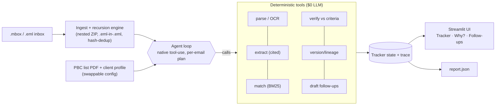

# PBC Email Agent — 1-Page Design

**What it is.** An agent that lives on an audit inbox and keeps a live, structured PBC
(prepared-by-client) tracker current — deciding, per document, whether the client delivered
what was asked (from **contents, never filenames**) with a reasoning trace a partner could
defend to a PCAOB inspector, and drafting grouped follow-ups for what's open.

## Architecture

Control flow is **agent-driven** (Claude decides per email what to do); the heavy lifting is in
**deterministic, unit-tested tools**. The loop is one file (`agent/loop.py`, ~180 lines).

## Model choice per step (route by cost)

| Step | Engine | Why |
|---|---|---|
| Per-email planning | **Claude Haiku 4.5** (default) | cheap dynamic control flow |
| ↳ escalation (≥4 attachments / ambiguous) | **Claude Sonnet 5** | harder reasoning, rare |
| Candidate matching | **BM25** (no LLM) | embeddings-class recall at $0 |
| Parse · OCR · extract · verify · version · draft | **Deterministic code** | reproducible, testable, $0 |

## Tools (native tool-use schemas)

`parse_attachment(doc_id)` · `extract_fields(doc_id)` · `match_item(doc_id)` ·
`verify_item(item_id, doc_ids[])` · `note_schedule(item_id, new_date)` · `draft_followups()` ·
`finish(summary)`. Each returns compact JSON + a one-line trace summary.

## Hallucination guardrails

- **Content over filenames** — type by magic bytes; `..._signed.pdf` with a DRAFT body is flagged.
- **Citations required** — every extracted fact carries a page/sheet + verbatim snippet; the
  verifier is **deterministic** (no free-text judgment), and reasoning is composed only from
  passed/failed checks — no invented numbers.
- **Uncertainty ≠ done** — low-confidence OCR / unconfirmable criteria become `UNVERIFIABLE`,
  never a silent Complete.
- **temperature 0**, structured tool I/O, content-hash dedup (a re-sent file is one delivery).

## Eval strategy

`python -m pbc_agent.eval.score` scores labeled cases on **status accuracy, insufficiency-
detection precision/recall/F1, expected tool-call-sequence match, and cost**. A **trap
simulator** (`tests/test_traps.py`) synthesizes the five adversarial classes (wrong period,
wrong entity, missing-invoice, hidden Excel tab, misleading filename) and asserts each is
downgraded. Deterministic unit tests cover parsing, versioning, and verify logic.

*Current (offline mock provider, sample bundle):* status accuracy 10/13, insufficiency
precision 1.0, tool-sequence match 1.0. Live native tool-use lifts matching further.

## Measured cost

**~$0.14 per full sample inbox** (39 emails), metered by the budget meter and shown in the UI;
the held-out (~2.4× emails) projects to well under the **$5** ceiling. A hard circuit-breaker
degrades to deterministic-only if the ceiling is approached. Matching/parse/OCR are $0.

## What breaks at 10 and 100 concurrent audits

- **10:** in-process is fine; watch Anthropic RPM/TPM — batch per-email planning and cache the
  static system/config prompt. OCR is CPU-bound → a small worker pool.
- **100:** move state from in-memory to a store (Postgres/Redis) keyed per engagement
  (the multitenancy seam); a task queue for OCR/parse workers; per-tenant budget + rate-limit
  isolation; the content-hash LLM cache cuts repeat spend. Cost stays ~linear (< $5/audit).
